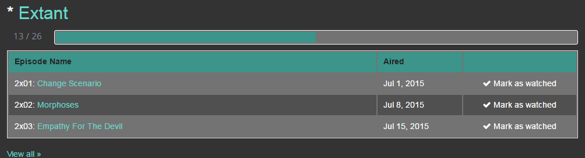
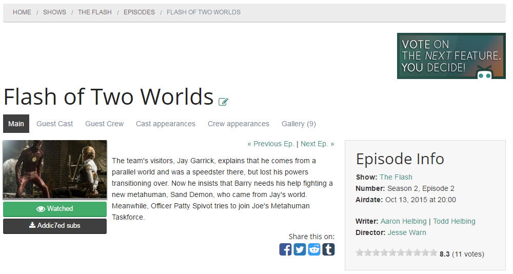
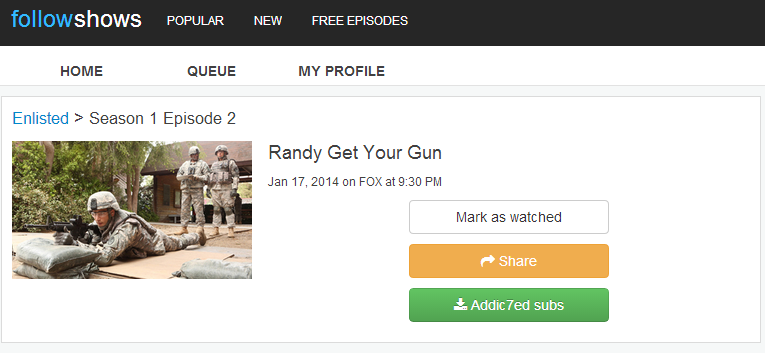
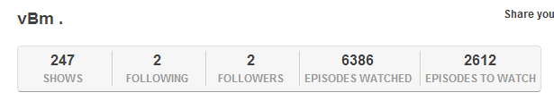

***Some of scripts I've wrote for personal use but decided to share 'em.***

# Mark ended shows on TVMaze

[This userscript](ended.tvmaze.user.js) has simple task of adding _*_ to [watchlist](http://www.tvmaze.com/watchlist) page for shows that have ended but you haven't watched 'em yet.

# Addic7ed TVMaze

[This userscript](addic7ed.tvmaze.user.js) has simple task of adding link to [Addic7ed](http://www.addic7ed.com/) page for desired episode on [TVMaze](http://www.tvmaze.com/).

# Addic7ed Followshows

[This userscript](addic7ed.followshows.user.js) has simple task of adding link to [Addic7ed](http://www.addic7ed.com/) page for desired episode on [Followshows](http://followshows.com/).

# FollowShows remaining episodes count

[This userscript](remaining.episodes.followshows.user.js) grabs the episode count and displays it on user profile.

